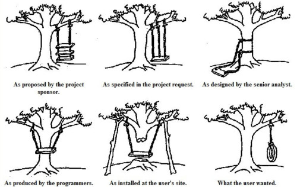

# Testing

---

## What you consider testing
- Check required functionality is there
- Check critical path works
---

## What we consider testing
- Unit Test
- Integration Tests
- Functional Tests
---

## Unit Tests
- Tests the code in isolation.
- These are useful to test specific parts of the code that don't require Magento to be booted up
---

## Integration tests
- Tests code when it's integrated (IE, installed into Magento)
- Tests against an actual running instance of Magento
- Good for testing if an upgrade breaks the code
- Generally more useful than Unit Testing
- Gives us a higher level of confidence that an upgrade didn't break our code
- Also gives us high confidence that installing another module didn't break our code
- We currently run these using Travis
---

## Who's Travis?
- Travis is a service we use that automatically runs these tests
- It either passes or fails the code
- We can't deploy new code without a pass
---

## Functional Tests
- We haven't started using these yet
- Tests are created to mimic user behavior
  - IE, add a product to basket, go to checkout, complete checkout
- Many of these tests can be quickly adapted for each client
---

## Why functional testing?
- If the client browses the site a certain way, we can script that
- Saves Aggie many hours of running through the same tests scripts
---

---

## How?
- There are a few ways we can achieve Functional testing
  - https://www.cypress.io/
  - https://ghostinspector.com/
- These services allow technical and non technical people to create these tests
- Cypress promises to allow us to create tests quickly
- Ghost inspector allows non technical people to create tests as well
---
